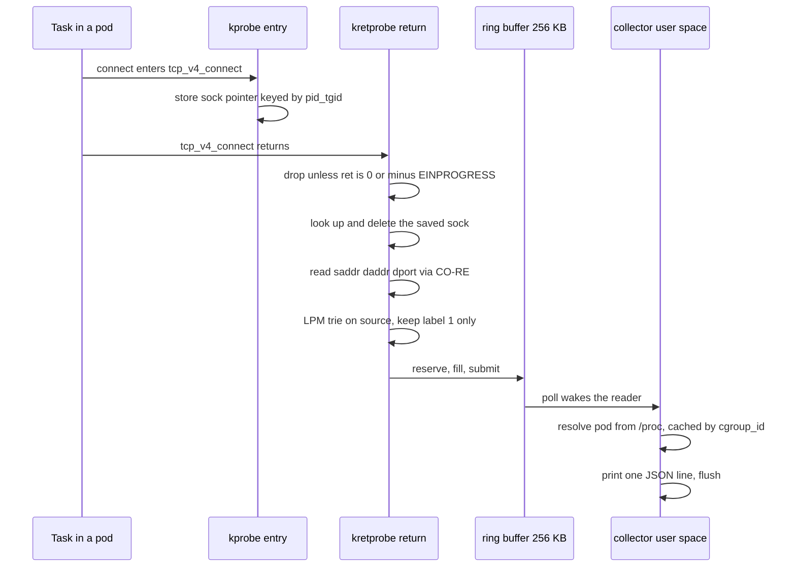

# K8sSecDaP-collector

The sensor for [K8sSecDaP](https://github.com/john-naeder/K8sSecDaP). An eBPF program hooks
`tcp_v4_connect` in the kernel, and a small libbpf daemon in user space turns each captured
connection into one line of JSON on stdout, annotated with the Kubernetes pod that made it.

The reason it exists in this shape: a port scan from a compromised pod is not visible to a
perimeter firewall and leaves no trace in the Kubernetes API. Packet capture would see the
traffic but not the process. A kprobe sees the connection *and* the `pid`, `comm`, `uid` and
cgroup of the task making it, which is the difference between an alert that says
"10.244.1.5 is scanning" and one that says "`nmap`, pid 12345, in pod `attacker` of namespace
`zt-targets`, is scanning".

One event, as emitted:

```json
{"src_ip":"10.244.1.5","dst_ip":"10.244.2.3","dst_port":8080,"pid":12345,"timestamp_ns":1234567890,"ppid":1,"uid":0,"comm":"nmap","cgroup_id":4242,"pod_name":"attacker","namespace":"zt-targets","container_id":"a1b2..."}
```

## How an event is made



Three details in that flow are the whole design.

**The kprobe and kretprobe are paired through a hash map keyed on `pid_tgid`.** At entry the
`struct sock *` is available but the connection has not been attempted; at return the outcome
is known but the argument is gone. Neither probe alone can emit a correct event, so entry
stores the pointer and return retrieves and deletes it. The map holds 4096 entries — an
in-flight `connect()` per task, so this is generous.

**`-EINPROGRESS` is treated as success.** A non-blocking socket returns -115 from
`tcp_v4_connect` and completes later. Most scanners, and most of the interesting traffic
generally, are non-blocking. Filtering on `ret == 0` alone would miss them, which is a
failure mode that looks like "eBPF does not work" rather than "the filter is wrong".

**The source filter runs in the kernel.** An LPM trie map holds the CIDR-to-label table, and
the return probe drops any connection whose *source* is not labelled 1, the pod network. The
threat model is a compromised pod, so the node's own outbound traffic — apt, kubelet, the
container runtime pulling images — is noise. Dropping it before `bpf_ringbuf_reserve` means it
never costs a ring-buffer slot or a user-space wakeup.

Pod identity is resolved without ever calling the Kubernetes API. `src/user/pod_meta.cpp`
reads `/proc/<pid>/cgroup` and parses the kubepods path — cgroup v1 and v2 layouts,
containerd, CRI-O and plain-hex container forms — for the container id and pod uid, then reads
the namespace out of the target's own service-account mount and the pod name from its
`/etc/hostname`. Results are cached by `cgroup_id`, which is stable per container and survives
the common race where the connecting process has already exited by the time the event is
handled. The pure parsers are split out so `tests/test_pod_meta.cpp` can drive them with
fixture strings and no live `/proc`.

## Layout

```
src/kern/tcp_connect.bpf.c   the BPF program: 3 maps, 2 programs, CO-RE reads
src/user/collector.cpp       loads and attaches, populates the CIDR map, drains the ring buffer
src/user/pod_meta.{h,cpp}    the /proc parsers, no kernel or libbpf dependency
tests/test_pod_meta.cpp      fixture-driven tests for those parsers
Dockerfile                   multi-stage: vmlinux.h, then the .bpf.o, then the daemon
build.sh                     stages the build host's BTF into the context, then docker build
Makefile                     native build for running directly on a node
```

## Build

Container image, which is how it is deployed:

```bash
./build.sh                          # stages /sys/kernel/btf/vmlinux, then docker build
IMAGE=<ref> ARCH=x86 ./build.sh     # override tag or architecture
```

`vmlinux.h` is generated from the *build* machine's BTF, and that is fine: CO-RE relocates
field offsets at load time against the *target* node's BTF. Building on a newer kernel than
the cluster runs is safe as long as the referenced types — `struct sock`,
`__sk_common.skc_*`, `task_struct.real_parent` — still exist there.

Natively, for testing on a node:

```bash
sudo apt install -y clang llvm libbpf-dev libelf-dev zlib1g-dev bpftool
make            # build/tcp_connect.bpf.o and build/collector
make test       # the /proc parser tests, no kernel needed
make run        # sudo ./collector, JSON lines on stdout
```

CI is `.github/workflows/build-collector.yml`: GitHub-hosted Ubuntu runners have a BTF-enabled
kernel, so the workflow copies `/sys/kernel/btf/vmlinux` into the build context and pushes the
image on non-PR builds.

## In the cluster

The collector is the first container of the DaemonSet in
`K8sSecDaP-soc/manifests/23-pipeline-ebpf.yaml`, writing into a FIFO on an `emptyDir` that
`zt-pipeline` reads as stdin, with `alert-bridge` publishing the result to NATS. It needs
`CAP_BPF` and `CAP_PERFMON` and the host's BTF mounted in.

```bash
kubectl -n zt-mapper logs ds/zt-pipeline-ebpf -c collector -f
```

Measured cost, from `K8sSecDaP-soc/scripts/eval/results/`: 168 ns in the entry probe and
1376 ns in the return probe, 1544 ns combined per connect, 95% confidence interval ±126 ns
over ten cycles of roughly 3000 connects each. The return probe dominates because it does all
the work — map lookup and delete, four CO-RE reads, an LPM lookup, and a ring-buffer reserve
and submit.

## Limits

- **IPv4 only.** The hook is `tcp_v4_connect`. IPv6 needs a second probe on
  `tcp_v6_connect` and a wider event struct. Not done.
- **TCP only, outbound only.** UDP scans and inbound connections are invisible.
- **x86_64 assumed.** `ARCH` is a build argument, but nothing has been built or tested on arm64.
- **The CIDR table is compiled in.** `populate_cidr_map` in `collector.cpp` hardcodes five
  ranges (`10.244.0.0/16`, `10.96.0.0/12`, `192.168.0.0/16`, `172.16.0.0/12`, `127.0.0.0/8`).
  A cluster on different CIDRs needs a recompile. It should be a flag or a config file.
- **The ring buffer is 256 KB and drops silently.** `bpf_ringbuf_reserve` returning NULL means
  the event is discarded with no counter and no log line. A connection storm loses events and
  nothing says so.
- **The Dockerfile and `CMakeLists.txt` build only `collector.cpp`**, not `pod_meta.cpp`,
  even though `collector.cpp` calls into it. Only the `Makefile` compiles both. The container
  build has drifted from the source and needs `pod_meta.cpp` added.
- **The pod-metadata cache never evicts.** One entry per `cgroup_id` ever seen; on a node
  churning through short-lived pods it grows without bound.
